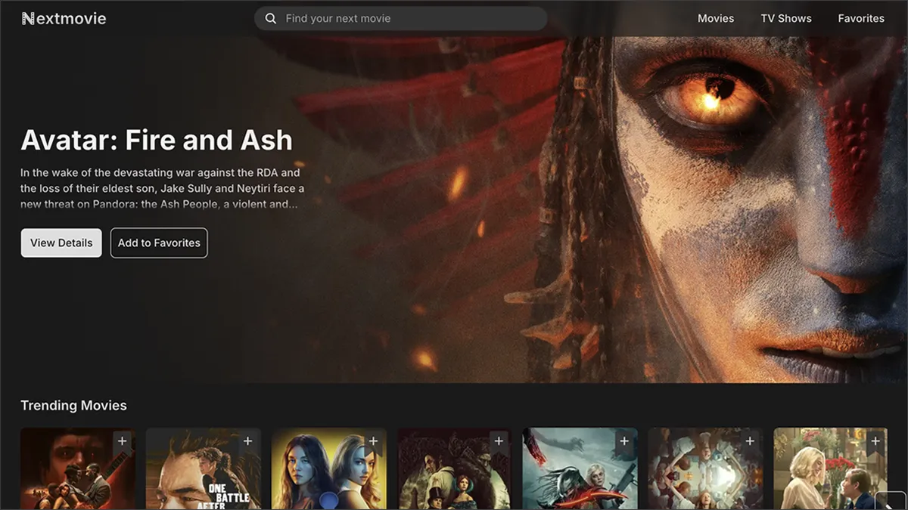
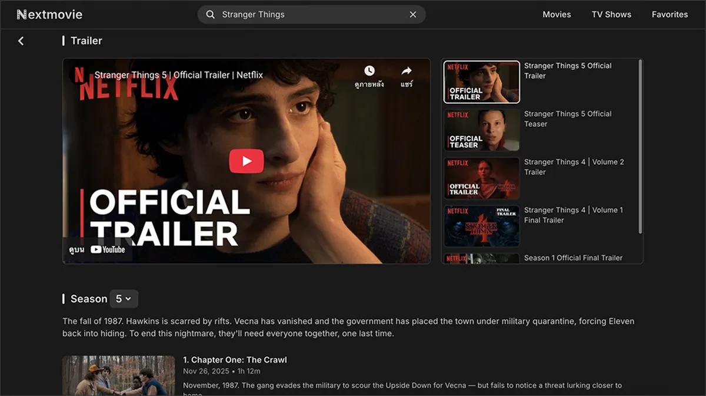
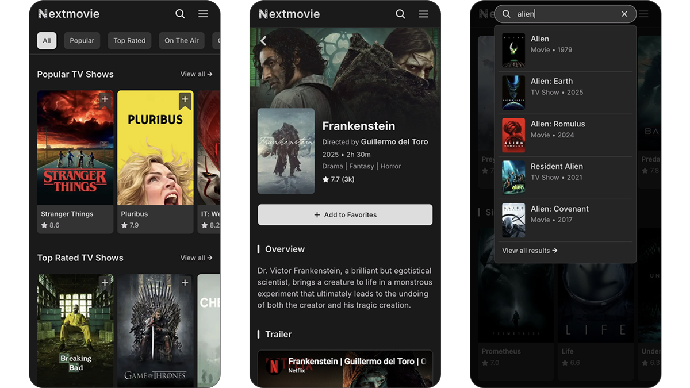

# Nextmovie — A Modern Movie & TV Discovery App

A modern frontend web app for discovering movies and TV shows, built with Next.js 16, React 19, TypeScript, and Tailwind CSS.

## Live Demo

Deployment in progress.

## Preview

## Features

- **Curated Media Carousels** — Browse trending, popular, top-rated, and now-playing movies and TV shows in carousel sections.

- **Instant Search** — Search movies and TV shows with real-time results and loading skeletons.

- **Paginated Discovery** — Explore popular, top-rated, now-playing, genre-based, and search results through dedicated pages with grid layouts and pagination.

- **Rich Media Details** — View details with overview, trailers, top cast, expandable key crew, metadata, related/similar content, recommendations, and season-based episode browsing for TV shows.

- **Interactive Trailers** — Switch trailers via selectable thumbnails with a smooth transition.

- **Favorites** — Add or remove favorite movies and TV shows without signing in.

- **Responsive Design** — Experience optimized layouts across mobile, tablet, and desktop devices.

- **Optimized Data Fetching** — Cache TMDB data using Next.js 16 Cache Components and HTTP caching for dynamic search results.

- **Error Handling & Feedback** — Handle errors with error/not-found pages and toast notifications for user actions.

## Tech Stack

Built with the latest Next.js 16 features and modern frontend technologies.

### Core

- **Next.js 16** _(App Router)_
- **React 19**
- **TypeScript**

### UI & Styling

- **Tailwind CSS** _(v4)_
- **Keen-Slider** _(carousel)_
- **OverlayScrollbars**
- **Motion** _(formerly Framer Motion)_
- **Sonner** _(toast)_

### Data & Utilities

- **TMDB API**
- **localStorage** _(favorites storage)_
- **slugify** _(SEO-friendly URLs)_

### Tooling

- **ESLint**
- **Prettier**
